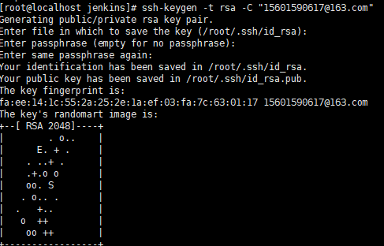

## Jenkins自动构建部署项目

#### 一、Jenkins在linux服务器上的安装

**1、需要一台linux服务器或者自己安装虚拟机存在linux系统。**

系统需要具备java环境以及tomcat容器：

**2、下载jenkins的通用war包，放在tomcat的webapp目录下运行项目，访问http://ip:port/jenkins
即可访问jenkins应用服务。**

通过配置服务器初始密码，以及jenkins初始安装的插件来启动jenkins服务：

**3、虚拟机配置git ssh-key 以及安装maven jar依赖管理工具**

**4、汉化jenkins，安装locale插件**

如果插件无法下载安装，需要重新更新update地址：
http://mirror.esuni.jp/jenkins/updates/update-center.json

汉化失败，locale插件安装正确重启jenkins不生效。
